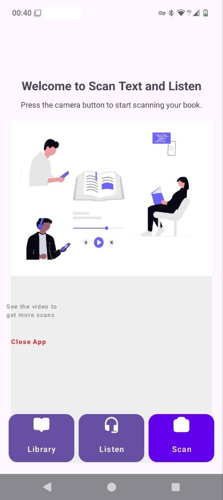
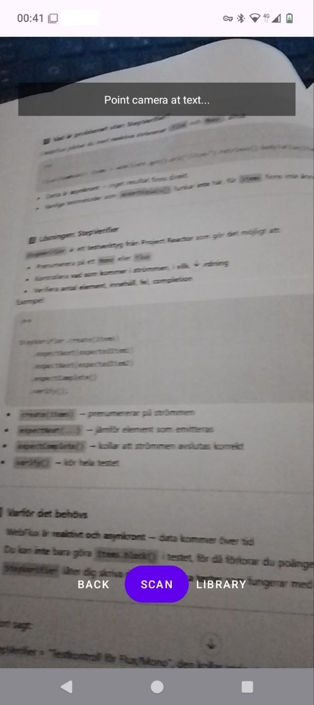
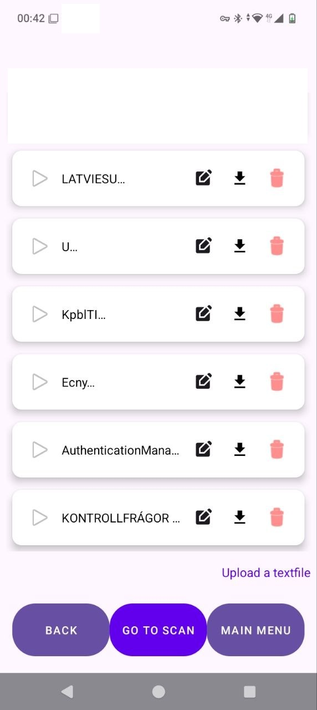
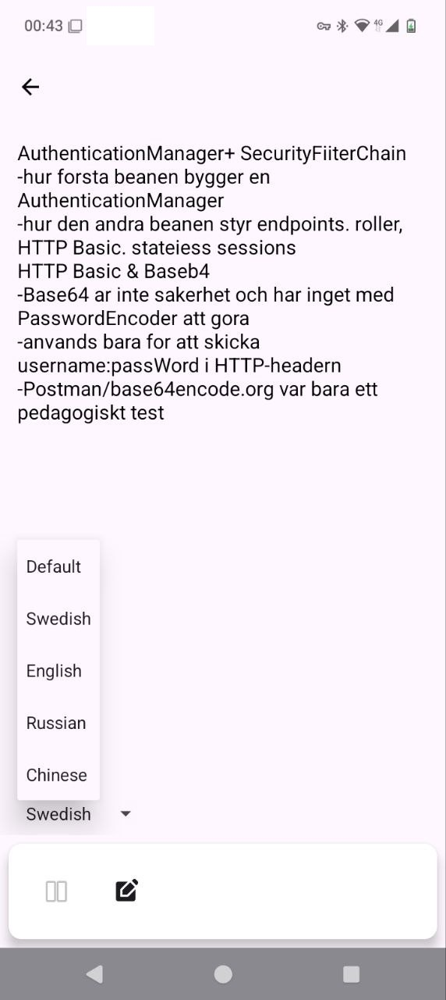

# ScanTextAndPlay

ScanTextAndPlay is a mobile app that allows you to **scan text from documents**, **store it in a library**, **edit it**, and **listen to it using text-to-speech (TTS)**. It's designed as a simple and intuitive tool to demonstrate text recognition and playback functionality.

---

## Features

- **Camera Scan** – Capture text from physical pages using the camera.
- **Text Recognition** – Uses ML Kit to extract text from images.
- **Library** – Stores all scanned texts as files for later access.
- **Reading Mode** – Listen to the text using TTS with selectable language options.
- **Edit & Save** – Edit scanned text and save updates.
- **Delete with Confirmation** – Remove items from the library safely.
- **Responsive UI** – Material Design components with CardViews and intuitive buttons.

---

## Screenshots

<!-- Replace with your actual images -->
| Camera Scan | Library View | Reading Mode |
|-------------|--------------|--------------|
|  |  |  |

---

## Demo Video

<!-- Replace with your actual demo video -->

  <video width="320" height="240" controls>
    <source src="assets/demo.mp4" type="video/mp4">
    Your browser does not support the video tag.
  </video>

---

## Usage

1. Open the app and go to the **Camera** screen.
2. Scan a page with text and preview the result.
3. Save the scanned text to the library.
4. Go to **Library** to view all saved scans.
5. Tap on a text to open **Reading Mode**, edit it if needed, and listen to it.
6. Delete items safely using the delete button with confirmation.

---

## Notes

- The TTS language selection is in **Reading Mode**, which affects playback only, not scanning.
- The app uses **internal storage** for saved texts; each scan is stored as a separate file.
- OCR may occasionally capture noise depending on image quality; best results are obtained with clear, well-lit pages.

---
## Screenshots

| Start | Scan | Library | Reading |
|-------|------|---------|---------|
|  |  |  |  |

---

## Demo Videos

- [Scan & Save](video/inVideo.mp4)
- [Reading & TTS](video/outVideo.mp4)

---

## Included Assets

This repository contains visual material demonstrating the app:

- Screenshots of key app views (start, scan, library, reading mode)
- Demo videos showcasing core functionality

---

This project is intended for **portfolio demonstration purposes**.